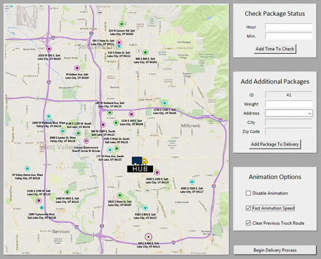
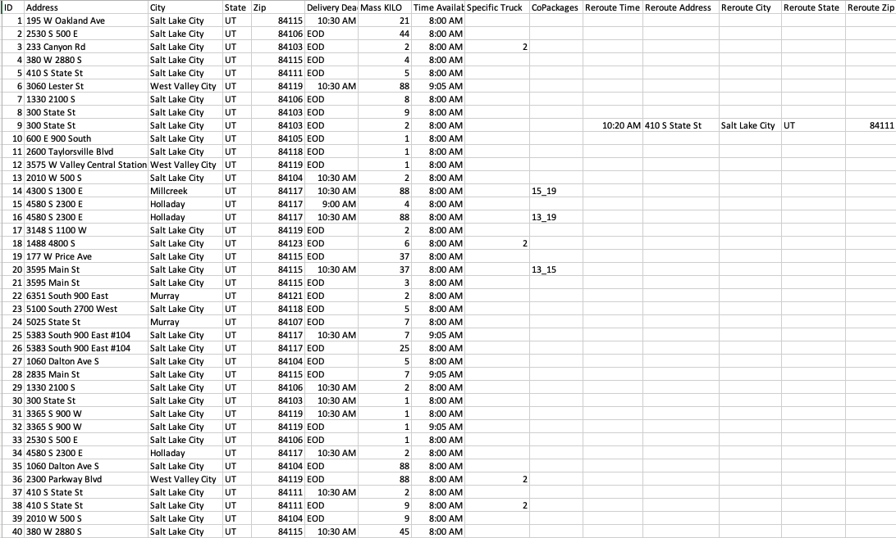
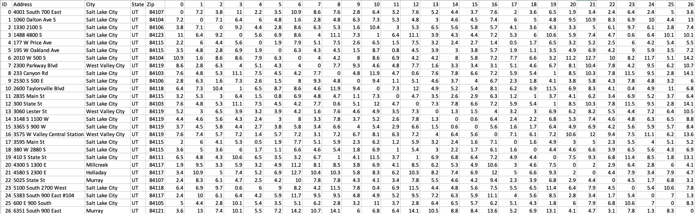
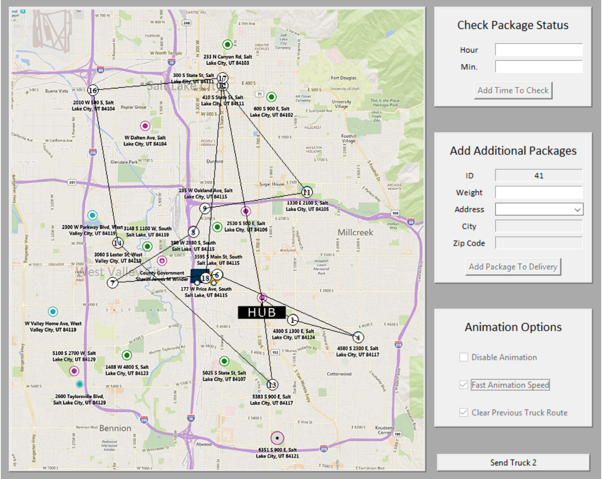
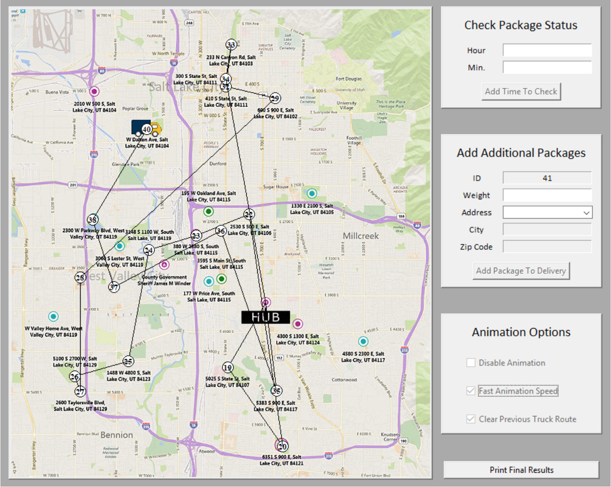
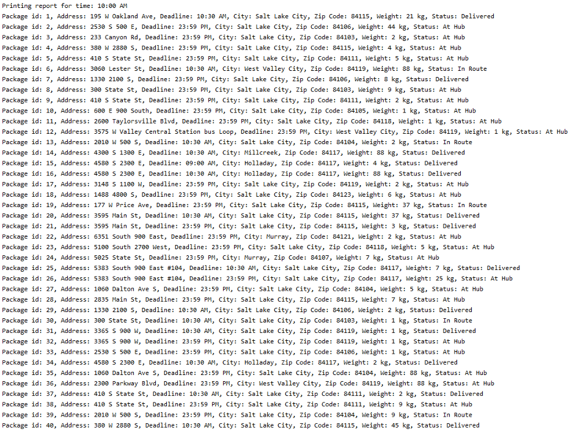
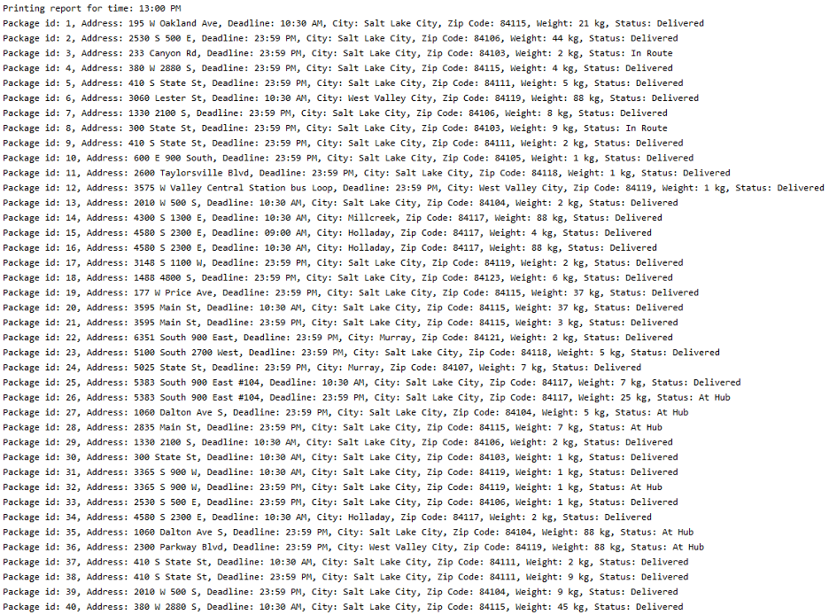

<h1 id="top"> Package Routing Application </h1>

Python application for optimizing package delivery according to time and distance constraints.

<h1 id="index"> Index </h1>
 <ol type="i">
   <li><a href="#features">Features</a></li>
   <li><a href="#user_interface">User Interface</a></li>
   <li><a href="#delivery_constraints">Delivery Constraints</a></li>
   <li><a href="#package_data">Package Input Data</a></li>
   <li><a href="#location_data">Location Data</a></li>
   <li><a href="#algorithm">Algorithm Overview</a></li>
   <li><a href="#results">Results</a></li>
 </ol> 
 
<h1 id="features"> Features </h1>

 <ol>
  <li>Graphical User interface that animates the delivery process.</li>
  <li>Console readout to provide narrative of each delivery step.</li>
  <li>User can check the status of package at a given time.</li>
  <li>User can add additional packages to any of the defined locations.</li>
  <li>Animations options can be adjusted to the user's preferences.</li>
  <li>Space-time complexitiy is evaluated using Big O notation throughout the entire program (see code).</li>
 </ol>
  

 <a href="#top">Back To Top</a>

<h1 id="user_interface"> User Interface </h1> 

  <kbd>
    
  </kbd>
   
  The user interface animatings the delivery process.  
  It also allows the user to customize the package status checks, add additional packages, and toggle animation options.  
  The user interface was created using Tkinter.
    
  <a href="#top">Back To Top</a>
    

<h1 id="delivery_constraints"> Delivery Constraints and Assumptions </h1>

 <ol>
  <li>40 Packages must be delivered by the end of the day.</li>
  <li>2 trucks are available for delivery - they cannot travel more than a combined 140 miles.</li>
  <li>Each package has a destination that it must be delivered to and a deadline for when it must arrive by.</li>
  <li>Each location has a distance provided to each of the other possible locations available for delivery.</li>
  <li>Each truck drives an average of 18 miles per hour and spends no time loading or unloading packages.</li>
  <li>A package could be delayed, rerouted, or have other packages that it must travel with.</li>
 </ol>
  

 <a href="#top">Back To Top</a>

<h1 id="package_data"> Package Data </h1>

  <kbd>
    
  </kbd>
  
  All the necessary package information is inputted into the program as the above .csv file.
    
  <a href="#top">Back To Top</a>

<h1 id="location_data"> Location Data </h1>

  <kbd>
    
  </kbd>
  
  All the necessary location information is inputted into the program as the above .csv file.
    
  <a href="#top">Back To Top</a>

<h1 id="algorithm"> Algorithm / Delivery Walkthrough </h1>

 
 <strong> Delivery Process (Greedy Algorithm) </strong>
 <ol>
  <li>All packages with deadlines are loaded on to the first truck.</li>
  <li>If there is still room, packages going to the same destination as a loaded package gets loaded on the truck.</li>
  <li>The current truck location is then analyzed to determine the closest delivery location for a loaded package.</li>
  <li>The truck travels to the location and unloads the package (Steps 3 and 4 repeat).</li>
  <li>Once new packages with deadlines are available, the truck returns to the hub to load them.</li>
  <li>Truck 1 delivers all the remaining packages that it has loaded.</li>
  <li>Truck 2 begins loading all packages at the hub until it is full.</li>
  <li>It then uses the earlier described greedy algorithm to delivery its packages.</li>
  <li>When truck 2 is empty, it returns to the hub for more packages.</li>
  <li>Once all packages are delivered, the delivery process is complete.</li>
 </ol>
  

  
  <strong> Truck 1 Delivery Route </strong>
   
  <kbd>
    
  </kbd>
  
  The result of truck 1's delivery route can be seen above.
  
   
 <strong> Truck 2 Delivery Route </strong>
  
 <kbd>
    
  </kbd>
  
 The result of truck 2's delivery route can be seen above.
 
   
 <strong> Status Report at 10:00 AM </strong>
  
 <kbd>
    
  </kbd>
  
 The status of all packages at 10:00AM can be seen above.
 
   
 <strong> Status Report at 13:00 PM </strong>
  
 <kbd>
    
  </kbd>
  
 The status of all packages at 13:00PM can be seen above.
 
    
  <a href="#top">Back To Top</a>
  

<h1 id="results"> Results </h1>

All constraints are respected, and the total mileage at the end of the delivery process is 115 miles. 

  

 <a href="#top">Back To Top</a>

